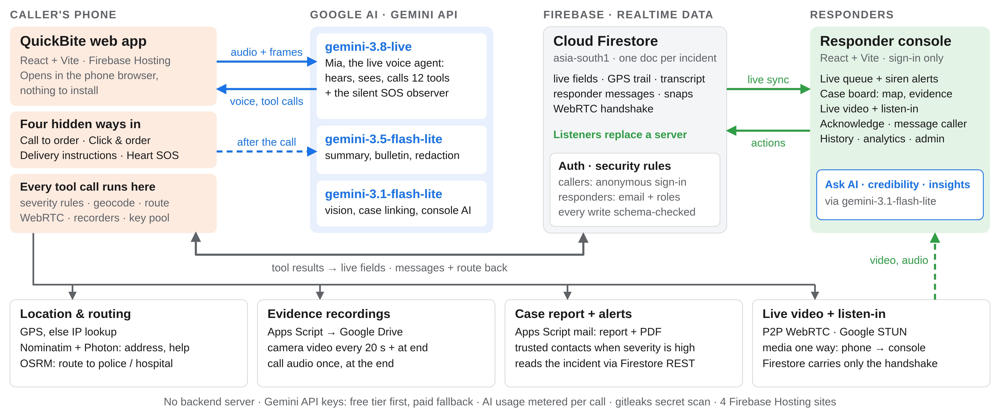
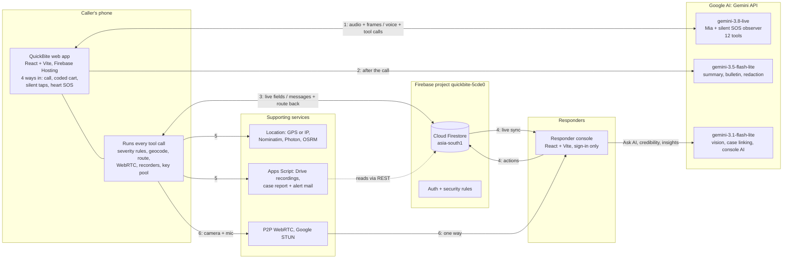
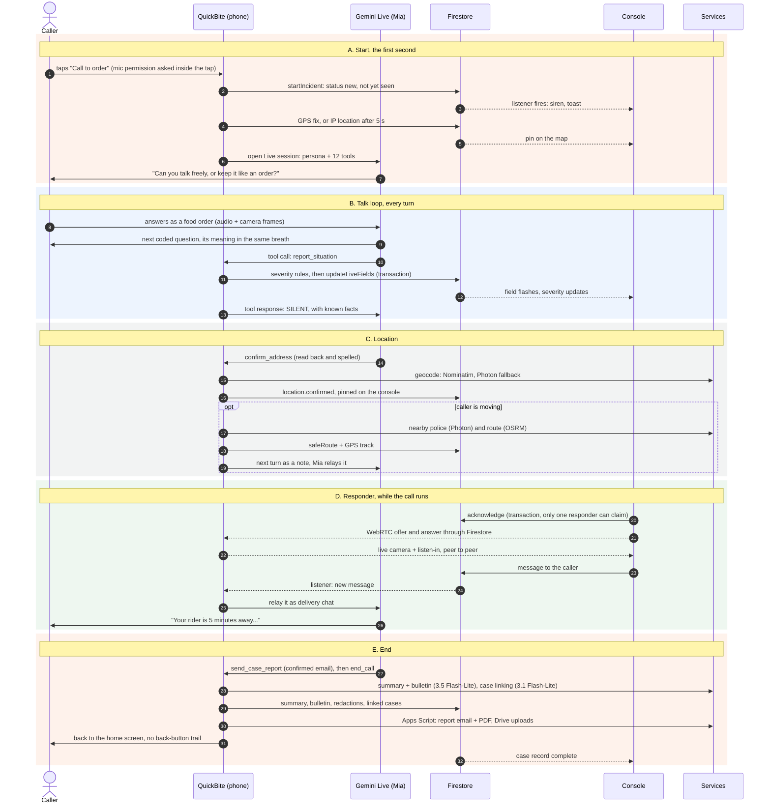
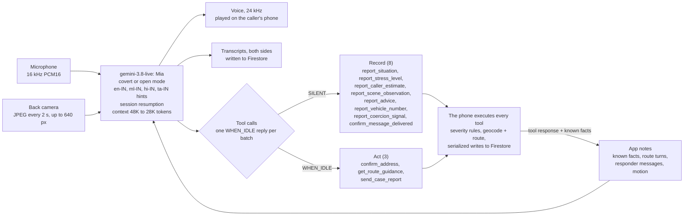
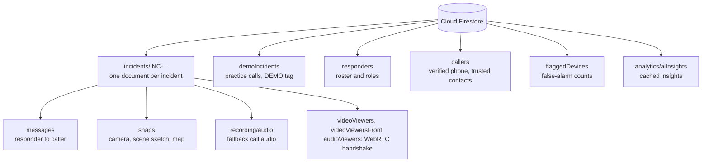
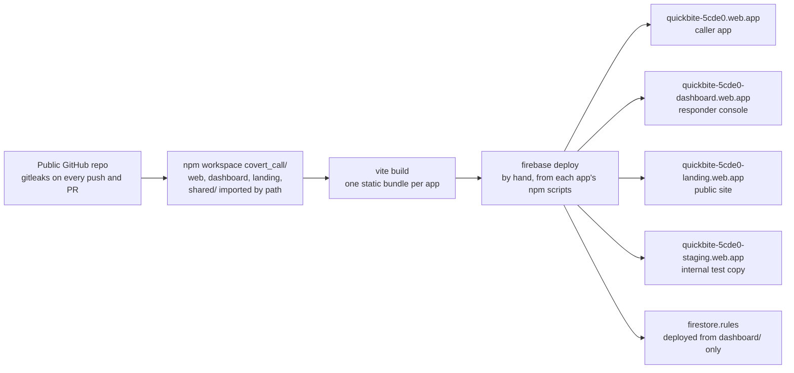

# QuickBite architecture

QuickBite has no backend server. The phone talks to Gemini Live directly, runs every tool call itself and writes each result to Cloud Firestore. The responder console listens to Firestore, so a fact Mia hears appears on the console within seconds. Recordings, mail, maps and live video use free services around that core.

This page shows the system that is deployed today, drawn from the code on `main` at commit `3893f4e` (9 Oct 2026). Files in this folder:

| File | What it is |
|---|---|
| [`quickbite-architecture-slide.png`](quickbite-architecture-slide.png) / [`.svg`](quickbite-architecture-slide.svg) | The overview above, sized for the deck's architecture slide |
| [`quickbite-architecture.html`](quickbite-architecture.html) | Interactive version: click any box for details. Download it and open it in a browser |

## 1. System overview

Four groups do all the work: the caller's phone, the Gemini API, Firebase, and the responder console. The phone is the only component that talks to Gemini Live, and Firestore's realtime listeners replace a server between the phone and the console. The numbers on the arrows match the overview picture.

| # | Flow | What moves |
|---|---|---|
| 1 | Live session | A WebSocket to Gemini Live. The mic (16 kHz PCM16) and a camera frame every 2 s go up. Mia's 24 kHz voice and tool calls come down, and tool results with known facts go back up. |
| 2 | After the call | Case summary, bulletin and redaction (3.5 Flash-Lite), then case linking (3.1 Flash-Lite). |
| 3 | Shared incident client | Each tool result is written to Firestore as it arrives. Listeners bring responder messages and routes back to the phone. |
| 4 | Realtime sync | The console listens to the incidents. Acknowledge, notes, messages and routes are written back. |
| 5 | Services | Location and routing, Drive recordings, and the case-report and alert mail. |
| 6 | Live media | Camera and mic stream one way, peer to peer, from the phone to the console. Firestore carries only the handshake. |

## 2. A live call, step by step

The incident exists in Firestore and rings on the console before Gemini says a word. After that, every answer becomes a tool call that the phone writes straight to Firestore, so responders read the situation while the call is still going. On 8 real calls on the deployed app, danger tags reached the console 2–3.5 s before the caller's words were transcribed.

| Way in | Incident created | AI used | What responders get |
|---|---|---|---|
| Call to order | After the mic works, before Mia speaks | Gemini Live (Mia), then Flash-Lite after the call | Live fields, voice stress, camera and sound evidence, route, video, listen-in, summary, report email |
| Click & order | At "Place order", only for a coded cart | None; the codes decode in the app | Danger tags, people count, urgency. The caller's order screen mirrors the response (rider assigned, on the way, delivered) |
| Delivery instructions | When the page opens | 3.1 Flash-Lite reads an optional photo (not stored) | Tapped meanings, photo observations, the confirmed address |
| Heart double-tap SOS | When the SOS opens, at high severity | Silent Gemini Live observer, then Flash-Lite | Sounds, threats, headcount, stress, back and front video, listen-in, trusted-contact alert |

## 3. The Gemini agent loop

Mia does not chat. Everything she learns leaves the session as a function call. The phone executes it, writes it to Firestore, and puts what is now known into the next tool response, so Mia never asks for something she already has.

`end_call` is answered SILENT and waits for the goodbye audio to finish (up to 12 s). Guards in the app code keep the call moving:

| Guard | Value | What it does |
|---|---|---|
| Silence watchdog | 20 s | Re-asks after silence. If danger was already reported, it keeps the line open quietly. It hangs up only after 3 unanswered nudges with no danger reported. |
| Reply guard | 8 s | Nudges Mia when the caller has waited; reopens the session if she is still silent 10 s after a nudge. |
| Missed short answer | 2.5 s | Voice was heard but no words were transcribed: Mia asks the caller to say it again. |
| Route budget | 6 s | If the route is not ready, Mia gets a holding line and the turns follow. |
| Voice stress | 5 s, then every 25 s | Mia reports stress from the caller's voice. |
| Backup frame check | 8 s | 3.1 Flash-Lite checks the latest frame in case Mia missed a person, weapon, vehicle, injury or fire. |
| Time budget | 2:00 and 3:00 | Notes ask Mia to wrap up, then say goodbye. These are nudges only; the app does not hang up on time. |

Reconnects are capped at 3 per drop and 8 per call. Each task uses the smallest model that does the job (`shared/aiModels.ts`). The free-tier key is tried first and the paid key takes over on a quota error, per model. Tokens per task are recorded on every incident.

## 4. Data and security

Firestore is both the database and the realtime channel. Its security rules (`covert_call/dashboard/firestore.rules`) do the job a server would: every write is checked against a fixed schema and the allowed transitions.

| Path | Read | Write |
|---|---|---|
| `incidents/{id}` | open | Caller app creates and updates, schema-checked; responder-only fields need a responder |
| `.../messages` | open | Responders create; the caller app may only mark one delivered |
| `.../snaps` | open | Caller app creates; never changed |
| `.../recording/audio` | responders | Caller app creates once |
| `.../videoViewers`, `videoViewersFront`, `audioViewers` | open | Console offers, phone answers |
| `demoIncidents/{id}` | open | Same checks as incidents |
| `responders/{email}` | email accounts | Admins only; the two founding admins self-provision once |
| `callers/{uid}` | owner, responders | Owner only; the phone must match the OTP sign-in |
| `flaggedDevices/{uid}` | responders | Responders |
| `analytics/aiInsights` | responders | Responders |

The rules also guarantee that:

- only known fields, with allowed values and sizes, are written;
- status only moves forward (new, acknowledged, in progress, resolved), and an ended call never goes live again;
- start time, way in and caller device id never change;
- notes, the stress trend, the reasoning and the transcript can only grow;
- status, notes, acknowledgement, viewed, outcome and credibility change only for an active responder;
- incidents, messages, snaps and recordings are never deleted.

## 5. Deployment

Everything that runs is static files on Firebase Hosting, plus managed services. There is nothing to scale, patch or keep alive.

| Runtime service | Used for | Cost model |
|---|---|---|
| Gemini API (Google AI Studio keys) | Live calls, summaries, vision, linking, console AI | Free-tier key first, paid key on quota errors |
| Cloud Firestore, Firebase Auth, Hosting | Data, realtime sync, sign-in, the four sites | Firebase project `quickbite-5cde0` |
| Google Apps Script, Drive, Gmail | Recordings, case-report email, trusted-contact alerts | No billing |
| OpenStreetMap: Nominatim, Photon, OSRM, tiles | Geocoding, nearby help, routes, maps | Free, no keys |
| IP lookup: geojs, ipwho.is, ipapi.co | Rough location when there is no GPS | Free, no keys |
| Google STUN | Connecting the peer-to-peer video | Free |

## Components and where they live

| Component | Tech | Deployed at | Key files |
|---|---|---|---|
| QuickBite web app | React 19, Vite, TypeScript | `quickbite-5cde0.web.app` | `covert_call/web/src/pages/`, `web/src/lib/gemini/liveSession.ts`, `tools.ts`, `persona.ts` |
| Responder console | React 19, Vite, ECharts, Leaflet | `quickbite-5cde0-dashboard.web.app` | `covert_call/dashboard/src/`, `dashboard/firestore.rules` |
| Covert Call website | React, Vite | `quickbite-5cde0-landing.web.app` | `covert_call/landing/src/` |
| Shared incident client | TypeScript, Firebase SDK | runs inside the apps | `covert_call/shared/incidents/client.ts`, `types.ts`, `severity.ts` |
| Location and routing | Nominatim, Photon, OSRM | runs inside the apps | `covert_call/shared/incidents/geocode.ts`, `location.ts`, `shared/nav/` |
| Live video | WebRTC, Firestore signalling | runs inside the apps | `covert_call/shared/video/publisher.ts`, `signaling.ts` |
| Model map and key pool | Gemini API | runs inside the apps | `covert_call/shared/aiModels.ts`, `shared/gemini/keyPool.ts` |
| Drive uploader, mailer | Google Apps Script | Apps Script web apps | `covert_call/docs/setup/drive-uploader.md`, `trusted-alert-Code.gs` |
